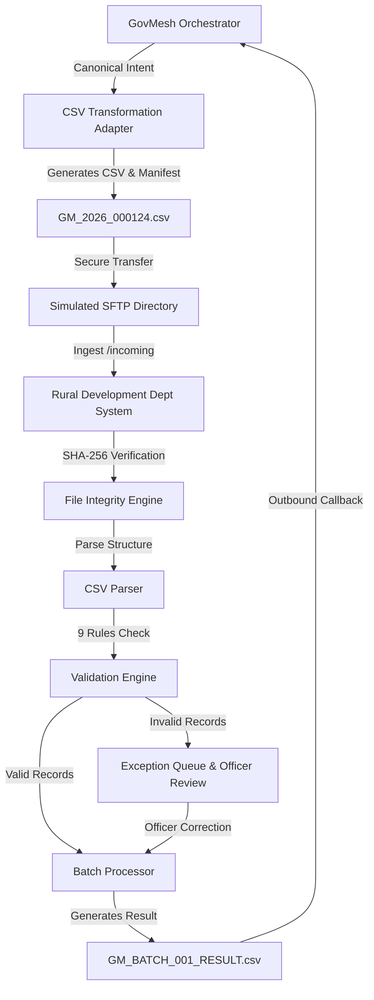

# GOVMESH – SIH26129

## Rural Development & Panchayat Raj Department – Maharashtra
### Standalone Department 3 – Legacy System Integration Sandbox & Demo Portal

> **DEMO / SANDBOX SYSTEM**  
> *Simulated Legacy CSV / SFTP Government Integration*

---

### 1. Project Overview

This repository contains the standalone **Department 3** web application for **GovMesh (SIH26129)**, representing the **Rural Development & Panchayat Raj Department, Government of Maharashtra**.

The primary objective of this module is to demonstrate **legacy system interoperability**. While modern departments might communicate via REST/JSON or SOAP/XML APIs, many existing government departments operate on legacy file-based infrastructure (e.g. batch CSV files transferred over SFTP). GovMesh proves that departments do **not** need to replace their legacy systems to participate in unified citizen services.

---

### 2. Problem

Government departments frequently rely on legacy software, mainframe databases, and file-based batch workflows. Upgrading or replacing these core systems across thousands of Gram Panchayats is extremely costly, risky, and time-consuming. When a citizen requests an update (such as an address change across multiple departments), legacy systems cannot consume modern REST webhooks directly.

---

### 3. Solution

GovMesh solves this through reusable **Legacy Adapters**. GovMesh standardizes citizen requests into a canonical data model, transforms the model into structured CSV files, securely transfers them via SFTP to the department system, parses and validates the records locally, processes the updates, and returns structured result files back to GovMesh.

```
GovMesh Orchestrator
       │
       ▼
Canonical Model Data
       │
       ▼
CSV Transformation Adapter
       │
       ▼
Simulated SFTP / File Transfer
       │
       ▼
Rural Development Department System
       │
       ▼
Local CSV Parser & Schema Validation
       │
       ▼
Batch Processor / Exception Queue
       │
       ▼
Outbound Result File (GM_BATCH_001_RESULT.csv)
       │
       ▼
GovMesh Citizen Workflow Update
```

---

### 4. Department

* **Department Name**: Rural Development & Panchayat Raj Department
* **State**: Government of Maharashtra
* **Application Title**: Rural Development Digital Processing Portal
* **System Identity**: Legacy Service Integration & Rural Record Processing System (Department 3)

---

### 5. MVP Features

* **Officer Authentication & Role-Based Access**: Multi-role login (Rural Development Officer, Panchayat Officer, Senior Officer, Department Admin, Auditor), simulated OTP flow (`123456`), and 15-minute inactivity session tracking.
* **Department Dashboard**: KPI cards for Files Received, Records Imported, Pending Apps, Processing, Completed, Rejected, Invalid, and Failed Transfers.
* **12-Stage Visual Pipeline**: Interactive 12-step flow diagram tracking data transformation from GovMesh to CSV, SFTP, Checksum verification, Validation, Batch processing, and Result return.
* **Incoming Files Manager**: File inventory table with single-file and batch CSV ingestion tools.
* **File Details & Manifest Viewer**: Technical file specifications, consent references (`CONSENT-00124`), purpose declarations, and **SHA-256 integrity verification**.
* **CSV Content & Schema Validation Engine**: Verifies column structure, column ordering, data types, Application ID formats (`GM-YYYY-XXXXXX`), mandatory fields, valid Maharashtra districts, and duplicate record detection.
* **Batch Processing Manager**: Visual progress bar, filterable record execution matrix, and automated result CSV export.
* **Exception Queue & Officer Review**: Queue capturing invalid records with field-scoped correction tools (editable District/Address, locked metadata) and reprocessing workflow.
* **Failed Transfers & Retry Simulator**: Monitors network transfer failures (`TX-00042`) with retry counters (Attempt 1, 2, 3) and status progression.
* **Presenter Demo Control Panel**: 1-click failure injections for SFTP downtime, corrupted checksums, schema mismatches, duplicate files, and demo reset.
* **Audit Logs & System Monitoring**: Immutable event audit logging and real-time directory telemetry for `/mock_sftp/incoming`, `/processed`, `/error`, `/outgoing`.

---

### 6. Legacy Integration

The application simulates a complete SFTP file exchange:

1. **Canonical JSON Payload** received from GovMesh orchestrator.
2. **CSV Adapter** transforms canonical JSON into legacy CSV format (`GM_2026_000124.csv`).
3. **SFTP Transfer** delivers file to `/mock_sftp/incoming`.
4. **Local Directory Watcher** detects new file arrival.
5. **SHA-256 Checksum** verified against sender manifest.
6. **CSV Parser & Validation Engine** checks schema rules.
7. **Batch Processor** ingests valid records into database.
8. **Result File Generator** creates `GM_2026_000124_RESULT.csv` in `/mock_sftp/outgoing`.
9. **GovMesh Callback** acknowledges completed workflow status.

---

### 7. Architecture



---

### 8. Tech Stack

* **Frontend**: React 18, TypeScript, Vite, Tailwind CSS, Lucide React icons.
* **Backend**: Node.js, Express (REST API server).
* **Database & Storage**: SQLite / JSON persistent store + File-system SFTP simulation directories (`mock_sftp/`).
* **Integrity & Hashing**: SHA-256 cryptographic hashing (`crypto` module).

---

### 9. Project Structure

```
SIH26129/
├── index.html                   # HTML Entry Point
├── package.json                 # Project dependencies & scripts
├── tsconfig.json                # TypeScript configuration
├── vite.config.ts               # Vite bundler & API proxy config
├── tailwind.config.js           # Tailwind CSS Govt portal theme
├── postcss.config.js            # PostCSS configuration
├── .env.example                 # Environment variables template
├── .gitignore                   # Git exclusion rules
├── mock_sftp/                   # Simulated SFTP directory storage
│   ├── incoming/                # Inbound CSV files & manifests
│   ├── processed/               # Archived processed files
│   ├── error/                   # Quarantined invalid files
│   └── outgoing/                # Generated result CSV files
├── server/                      # Express Backend Server
│   ├── index.js                 # Entry server file (Port 5000)
│   ├── db.js                    # Database store manager
│   ├── sftpSimulator.js         # SFTP directory & checksum engine
│   ├── validationEngine.js      # CSV schema validation engine
│   └── routes/
│       └── api.js               # REST API endpoints
└── src/                         # React Frontend Client
    ├── main.tsx                 # React entry point
    ├── App.tsx                  # Root state & page router
    ├── types.ts                 # TypeScript interface definitions
    ├── index.css                # Global styles & Tailwind directives
    ├── components/              # Header, Sidebar, Banner, Pipeline, Controls
    └── pages/                   # Login, Dashboard, Incoming, Details, Validation,
                                 # Batch, Exceptions, Review, Transfers, Audit, Health
```

---

### 10. Installation

```bash
# Clone the repository
git clone <repository-url>

# Navigate into project directory
cd SIH26129

# Install dependencies
npm install
```

---

### 11. Environment Setup

Copy the `.env.example` file to create `.env`:

```bash
cp .env.example .env
```

Environment variables:
* `PORT`: Backend server port (Default: `5000`).
* `NODE_ENV`: Runtime mode (`development` / `production`).
* `DATABASE_FILE`: Local SQLite/JSON data path (`./data_store.json`).
* `SFTP_HOST`: Simulated SFTP hostname (`demo-sftp.internal`).

---

### 12. Running Locally

```bash
# Option A: Start Fullstack Production Server (Serves API + Built SPA)
npm run start
# Open http://localhost:5000

# Option B: Build Frontend
npm run build

# Option C: Start Vite Dev Server (with HMR & API Proxy)
npm run dev
# Open http://localhost:3000
```

---

### 13. Demo Credentials

| Role | Username | Password | OTP Code | Jurisdiction |
| :--- | :--- | :--- | :--- | :--- |
| **Rural Development Officer** | `officer_pune` | `demo1234` | `123456` | Pune District |
| **Panchayat Officer** | `panchayat_admin` | `demo1234` | `123456` | Nashik District |
| **Senior Officer** | `senior_officer` | `demo1234` | `123456` | State HQ |
| **Department Admin** | `admin` | `demo1234` | `123456` | All |
| **Auditor** | `auditor` | `demo1234` | `123456` | Audit Division |

> **DEMO ONLY – NOT FOR PRODUCTION**

---

### 14. Demo Workflow

1. **Officer Login**: Authenticate as `officer_pune` with OTP `123456`.
2. **Dashboard**: View KPI counters and verify SFTP Connector status (`ONLINE`).
3. **Incoming Files**: Select `GM_2026_000124.csv` from inbound queue.
4. **File Details**: Review metadata manifest, consent reference, and verified SHA-256 checksum.
5. **CSV Validation**: Trigger validation check &rarr; all 9 schema rules pass.
6. **Batch Processing**: Process batch file (`GM_BATCH_002.csv` with 100 records) &rarr; 96 Valid, 4 Invalid.
7. **Exception Queue**: Review invalid record `GM-2026-000125` (Missing District).
8. **Officer Review & Correction**: Click "Correct", assign district "Pune", save correction, and click "Reprocess".
9. **Result File Generation**: View outbound `GM_BATCH_002_RESULT.csv` and click "Send to GovMesh".
10. **Audit Logs**: Confirm complete transaction trail recorded in immutable audit log.

---

### 15. Failure Demonstration

1. Open **Presenter Demo Controls** bar at top of Dashboard.
2. Toggle **[Simulate SFTP Failure]**.
3. Legacy connector status changes to **OFFLINE / ERROR**.
4. Transfer enters **Failed Transfers Queue** (`TX-00042`).
5. Click **[Retry Transfer]** &rarr; retry counter progresses (Attempt 1, 2, 3) &rarr; connection recovers to **SUCCESS**.

---

### 16. Security Notes

* **Simulated Sandbox**: All citizen names, addresses, application IDs, and consent references are fictional demonstration data.
* **Integrity Hashing**: SHA-256 hash algorithms ensure file integrity during simulated SFTP transfer.
* **Role-Based Access Control**: Granular permissions across 5 officer roles.
* **Immutable Audit Trail**: All officer edits, status changes, and file ingestion events are recorded.

---

### 17. GovMesh Cloud Interoperability & Deployment

The Rural Development backend is deployed as a serverless microservice on Vercel, providing cloud-to-cloud interoperability with the GovMesh Core backend without requiring local servers.

* **Production URL**: `https://sih-26129-gov-mesh-rural-develpment.vercel.app`
* **Health Endpoint**: `GET https://sih-26129-gov-mesh-rural-develpment.vercel.app/api/health`
* **Interoperability Ingress**: `POST https://sih-26129-gov-mesh-rural-develpment.vercel.app/api/rural/address-update`
* **Application Status**: `GET https://sih-26129-gov-mesh-rural-develpment.vercel.app/api/rural/application/:id`

#### Deployment Topology
```
GovMesh Core Backend (Port 5000 / Cloud Host)
       │
       ▼ (Server-to-Server HTTPS)
Rural Development Adapter
       │
       ▼ (POST /api/rural/address-update)
https://sih-26129-gov-mesh-rural-develpment.vercel.app
       │
       ▼
Vercel Serverless Function (/api/index.js -> server/app.js)
       │
       ▼
Rural Development Validation Engine & Datastore (PostgreSQL / In-Memory)
```

---

### 18. Future Scope

* **Production SFTP Connector**: Integration with enterprise OpenSSH / AWS Transfer SFTP servers.
* **Digital Signatures**: X.509 PKI digital signatures for CSV file manifests.
* **Real Maharashtra API Bridge**: Direct integration with MahaOnline / Aaple Sarkar portal webhooks.
* **Advanced Monitoring**: Prometheus & Grafana telemetry for legacy adapter health.
